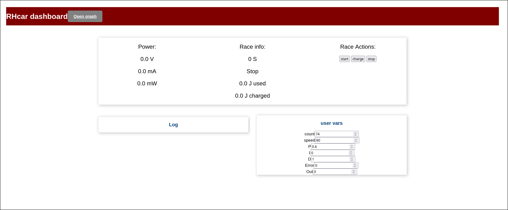
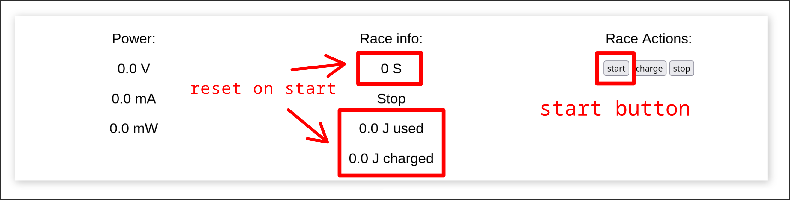
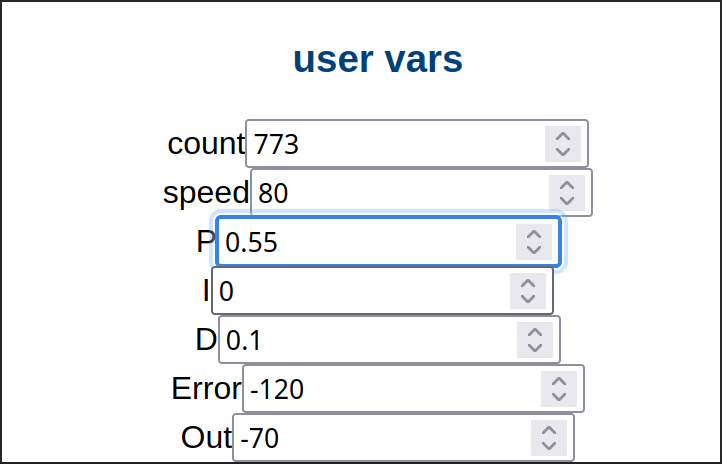
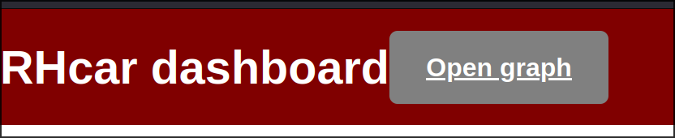
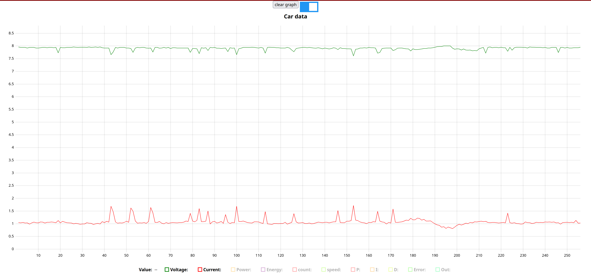
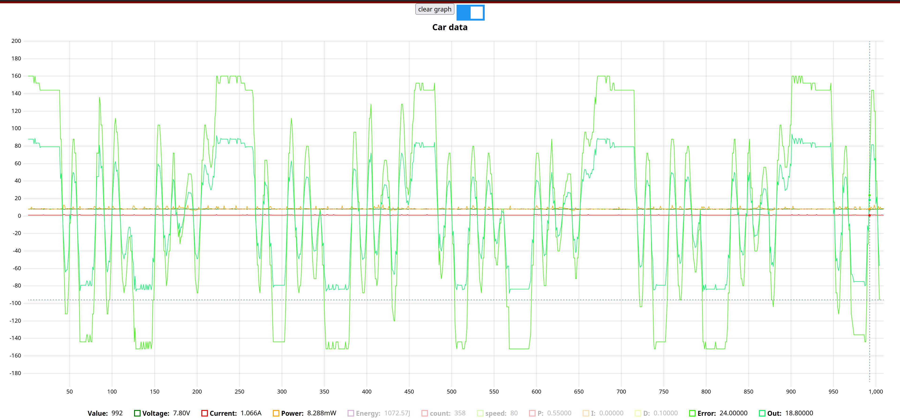
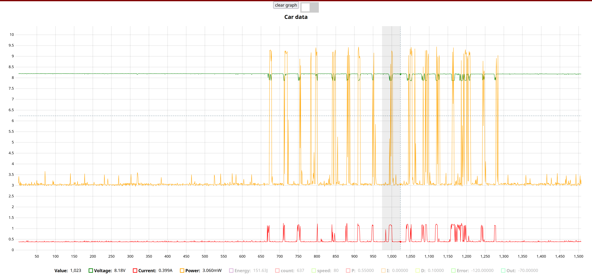
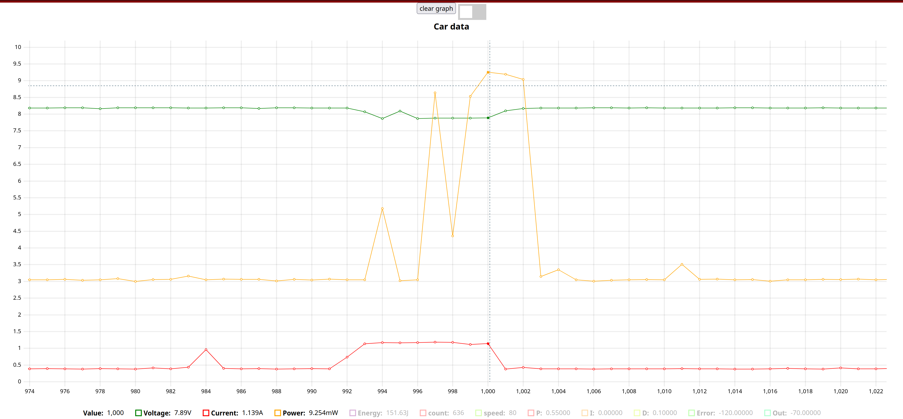

# Team04-ASMW

## Milestone 1

Basic BT communication, stering/drive, camera, and current measurements working 

All code is in the tinkering/tinkering.ino file

## Milestone 2

Code is in RHcar/main

# Documentation Plan:

  Relationship to ECE technology:
	Computer Engineering: 
		Microcontrollers (C/C++ Programming)
		Feedback control systems		
		Reading documentation
		
	Electrical Engineering:
		Capacitor I/V relation, how it corresponds to energy/power
		Capacitors in series vs. parallel
		Zener diodes/other cell balancing methods
		Reading datasheets

	There will be a user guide to give a brief overview of the capacitor concepts, with instructions 
	of how reach full understanding of the concepts, as well as a full explanation of the purpose
	of balancing and the method used to balance. The data sheet for the capacitors will be included
	to facilitate understanding the choices made and the purpose of them. 

  UI Manual/Obtaining and Using Software
	The UI manual will also include instructions for accessing the web-interface, and documentation
	of what each portion does.The UI manual will instruct for obtaining, editing and uploading the
	code. For editing code, arduino IDE v2 will be used (instructions included).

  API for Writing New Programs
	Each file in the github will have ample documentation in the form of headers and comments both
	to inform of the purpose of each file and to instruct of how to edit the file to make the 
	changes necessary to understand the microcontroller and PID functions with some experimentation.
	This will be done on a function level, with descriptive enough documentation to understand how each
	variable that can be changed. Example programs will also be provided that allow the car to 
	have basic functionality.

## Milestone 3

	Code is in RHcar/main

## Milestone 4

### UI overview

1. Power on the car and connect to the wifi network it creates
	the name of the wifi network is defined by the ```car_name``` variable in main.ino and

2. open your web browser and go to ```http://192.168.4.1```. you will see the main page of the UI: 

This page contains 3 primary sections: 
1. The top section contains the power and race information from the car. 
	- On the left it contains the power data for the car, updated 30 times per second. 
	- In the center it contains race information in the order: Time elapsed, race phase (currently unimplemented), total energy consumed during the race, and total energy gained from charging. 
	- On the right it contains buttons that control the race
2. The log section contains log messages from the car, added by calling ```log(message)```. 
3. The user vars section displays and allows the changing of the data stored in the user variables defined in the code.
	
### Running the car
1. place the car on the track and confirm that the huskylense is tracking the center line
2. on the UI, press the start button. This will reset the timer, reset the energy used, and set the race phase to ```First```, causing the  car to begin driving around the track. 
3. At the start of the race, the car will drive in racephase "First" for 90 seconds, or until the "charge" button is pressed, whichever happens first. The car will then enter "Charge" or "EarlyCharge" race phase, where it will stop driving. After the timer reaches 135 seconds, the car will enter racephase "Second" and resume driving until the timer reaches 180s. At that point the race is over and car will enter racephase "Stop", setting the speed to 0 and freezing the energy data.

### User variables
Any data that is stored in a user variable (instantiated via ```UserFloat name("display name");``` or ```UserInt name("display name");```) viewed and modified in the user vars section of the UI. 
- Values are pushed from the car to the UI 30 times per second. In order to display a value using a user var, call the ```.set(value)``` function to update its value. 
- in order to set a value, first click on the entry box for the variable you want to change such that it highlights  Then type the new value into the entry box. The updated value will be sent to the car when you click away or press enter.

## Graph

In order to access the graph view press on the Open graph button in the header of the main page  This will open the graph page in a new tab. 

By default the graph shows the cars voltage and current readings over time. 

Below the graph are all the data series that can be viewed. The first 5 are the power data from the car and the rest are the user variables. By clicking on the colored icon next to a series, its visibility can be toggled. The graph will autoscale to fit the new data. Furthermore, by hovering over the graph cursors will appear and the exact values of the data points the cursor intersects will be displayed by the series labels. 

Above the graph there are 2 controls. The clear graph button removes all the data from the graph. The switch controls wether the graph is updating. It defaults to on but by toggling it off you feeze the data in the graph. With the data frozen you can zoom into an area of the graph by dragging to select it.  
unfreezing the graph will zoom the graph back out


## Milestone 6

## code organization

all student code should go in the main.ino file

within the main.ino file, static variables should go at the top of the file. These include user variables, constants, and global values.

the setup() function is called once when the car initially turns on. in it the car.init_car() function should be called. user variables should also be initialized to default values.

in the loop() function is run continuously while the car is on. In it the race state should be checked and the action the car takes determined accordingly. loop should run every 33ms. If it takes longer the pid controller will not preform as well and running it faster wastes compute as the camera only updates at 30FPS.

the drivecar() function is created to make the loop() function more understandable. It gets data fromt he camera and then runs it through the control algorithm in order to determine the cars speed and servo angle.

## RHcar API

	RHcar();

creates a new RHcar. should only be called once in order to make a global variable

	void init_car(const char* name);

initializes the car hardware. blocks until the initialization is done. the string passed in is the name of the wifi network the car creates. should be called in setup().
    
    void log(String);

logs a message to the web dashboard's log window. The string is what will be logged.

    void update_dashboard();

Updates the web dashboard, runs power and energy calculations, updates user variables, updates race timer and race phase, and handles charging. should be run ONCE every time loop() runs

    float get_voltage();

gets the voltage of the capacitor bank

    float get_current();

gets the amount of current the car is drawing at the time its called

    float get_watts();

gets the power the car is using at the time its called

    float get_energy_used();

gets the total evergy used by the car over the course of the race in jules

    float get_energy_remaining();

gets the usable energy remaining in the capacitors in jules

    void set_motor_power(int pwr);

sets the power of the motor, 0 meaning off and 180 being full power

    void set_stering_angle(int angle);

sets the angle of the servo, 0 being full left, 90 being straight, and 180 being full right

    int get_race_time();

gets the amount of time elapsed in the race

    HUSKYLENS camera;

the initlised HUSKYLENS camera object, ready to have the line data be read

    RacePhase RacePhase;

the current phase of the race, the possible values are
Stop : the race is over and the car should not move
First : the race has begun and we are in the first 90 seconds
EarlyCharge : the user has pressed the charge button on the dashboard, the car should stop to allow for charging
Charge : the first 90 seconds of the race has elapsed and the acr must stop to charge
Second : charging is complete and the race has 45 seconds or less remaining


## UserVariables

NOTE: only 16 user floats and 16 user ints can exist at a time.

user floats are limited to 5 decimal places of precision when sending or receiving to the dashboard

	UserInt(const char* name);
	UserFloat(const char* name);

creates a new user variable where the name is what is displayed in the dashboard decide its entry box
    
    void set(int value);

sets the value of the user variable. The value will be updated on the dashboard when update_dashboard() is called.

    int get();

gets the latest value of the user variable. will be the most recently set value until a new value is received from the web dashboard.